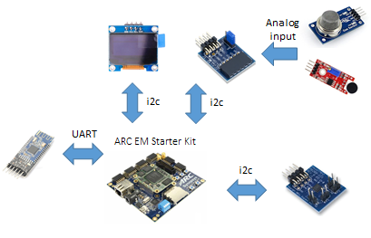

# COPD
* [Introduction](#introduction)
  * [Functions](#functions)
  * [System Architecture](#system-architecture) 
	* [Hardware System](#hardware-system)
		* [Hardware devices](#Hardware-devices)
		* [Hardware Connection](#Hardware-Connection)
	* [Software System](#software-system)
* [Hardware/Software Setup](#hardwaresoftware-setup)
  * [Hardware Requirements](#hardware-requirements)
  * [Software Requirements](#software-requirements)
* [Demo](#demo)
	* [COPD Respiratory Sounds Classification](#copd-respiratory-sounds-classification)
		* [Method](#method)
		* [result](#result)
* [User Manual](#user-manual)
	* [Excute the code](#Excute-the-code)
  
## Introduction
Wearable and Environmental Sensors to Enable Precision Medicine for Chronic Obstructive Pulmonary Disease.

This project developed a wearable vest want to solve two problems.
First, provide quantifiable physiological signal and environmental information, as an important reference for physician diagnosis and improve the patient's subjective statements at the time of the doctor's consultation to cause the deviation of the diagnosis.
Second, the use of wearable devices to achieve the purpose of real-time monitoring, effectively prevent the harm caused by sudden illness.

### Functions
* Collect breathing sound by 0687A mic sensor.
* Real time monitoring the physiological and environmental information, such as temperature, humidity, and VOC.
* Classify the data of breathing sound by our model.
* Once detecting COPD, our system starts to record the information in real time. 


### System Architecture
#### Hardware System

#### Software Systm


## Hardware/Software Setup
### Hardware Requirements
#### Hardware devices
* [ARC EM Starter Kit](https://embarc.org/embarc_osp/doc/build/html/board/emsk.html)
* [HM-10 BLE (Bluetooth)](http://jnhuamao.cn/bluetooth.asp?id=1)
* [SSD1306 - Adafruit (Screen)](https://www.adafruit.com/product/326)
	* [Library](https://github.com/adafruit/Adafruit-GFX-Library)
* [Pmod AD2: 4-channel 12-bit A/D Converter (Analog-to-digital converter)](https://store.digilentinc.com/pmod-ad2-4-channel-12-bit-a-d-converter/)
* [MQ135 sensor (Gas)](https://arduino.co.ke/product/mq135-mq-135-air-quality-sensor-hazardous-gas-detection-module-for-arduino/)
* [ADT7420 (Temperature)](https://www.analog.com/en/products/adt7420.html#product-overview)
* [ADS1256 (Analog-to-digital converter)](http://www.ti.com/lit/ds/sbas288k/sbas288k.pdf)
* [LM386 (Sound sensor)](https://goods.ruten.com.tw/item/show?21550300879819)
#### Hardware Connection
* Connect HM10 to J1 (UART)
* Connect SSD1306 to J2 (i2C)
* Connect PmodAD2 to J4 (i2C)
* Connect ADT7420 to J4 (i2C)
* Connect ADS1256 to J6 (SPI)
* Connect MQ135 to PmodAD2
* Connect Mic to ADS1256

  
### Software Requirements
* Install the listed python libraries by the following bash commands.
  * NUMPY 
  ```C
  	sudo pip install numpy
  ```
  * MATPLOTLIB 
  ```C
  	sudo pip install matplotlib
  ```
  * SCIPY : 
  ```C
  	sudo pip install scipy
  ```
  * SKLEARN 
  ```C
  	sudo pip install sklearn
  ```
  * Simplejson : 
  ```C
  	sudo pip install simplejson
  ```
  * eyeD3 : 
  ```C
  	sudo pip install eyed3
  ```
  * pydub : 
  ```C
  	sudo pip install pydub
  ```
  * python-tk
  ```
  	sudo sudo apt-get install python-tk
  ```
  * ffmpeg
  ```
  	sudo add-apt-repository ppa:jonathonf/ffmpeg-4
  	sudo apt-get install ffmpeg
  ```


## Demo
### COPD Respiratory Sounds Classification
#### Method

**Training data sources**
  * [Respiratory sound database](https://www.kaggle.com/vbookshelf/respiratory-sound-database)
  * [Basics of Lung Sounds](https://www.easyauscultation.com/course-contents?courseid=201)
  * [R.A.L.E Repository](http://www.rale.ca/Default.htm)
#### Result
To demonstrate our result of COPD respiratory sounds classification, please follow the instructions below.
##### step 1 : Make sure libraries mentioned in [Software Requirements](software-requirements) have already installed.
##### step 2 : Go to "scripts" folder : ../software/scripts.
##### step 3 : Run the demo shell script by bash command : *sh demo.sh*.
After running step 3, you will see the information on your terminal as shown in the picture below.

**As you can see, 23 of 25 COPD breathing sound data contained in the COPD_test folder are correctly determined as COPD class by our model. The accuracy is roughly 92%, and we will use this model to analyze the data acquired by EMSK**
## User manual
### Excute the code
Before run 
1. Git [embarc_osp](https://github.com/foss-for-synopsys-dwc-arc-processors/embarc_osp) to your PC or notebook.
```C
	git clone https://github.com/foss-for-synopsys-dwc-arc-processors/embarc_osp
```
2. Copy demo folder from our repository under baremental folder on your PC or notebook.
```C
	 C:/../embarc_osp/example/baremetal/
```
3. Go to demo folder
```C
	 cd ../embarc_osp/example/baremetal/demo
```
4. Under demo folder, use "make run" or "build .elf" to excute our code
```C
	 >>> make run
	 or 
	 >>> build .elf
```
